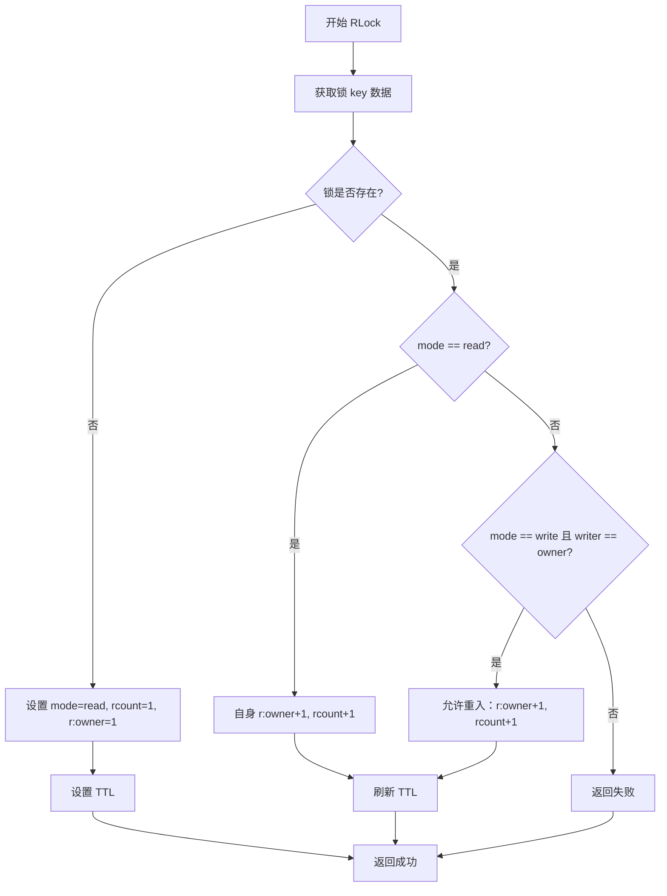
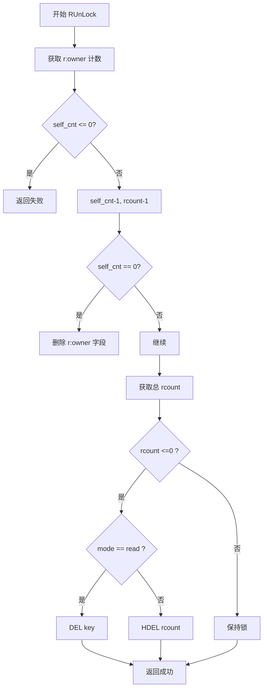
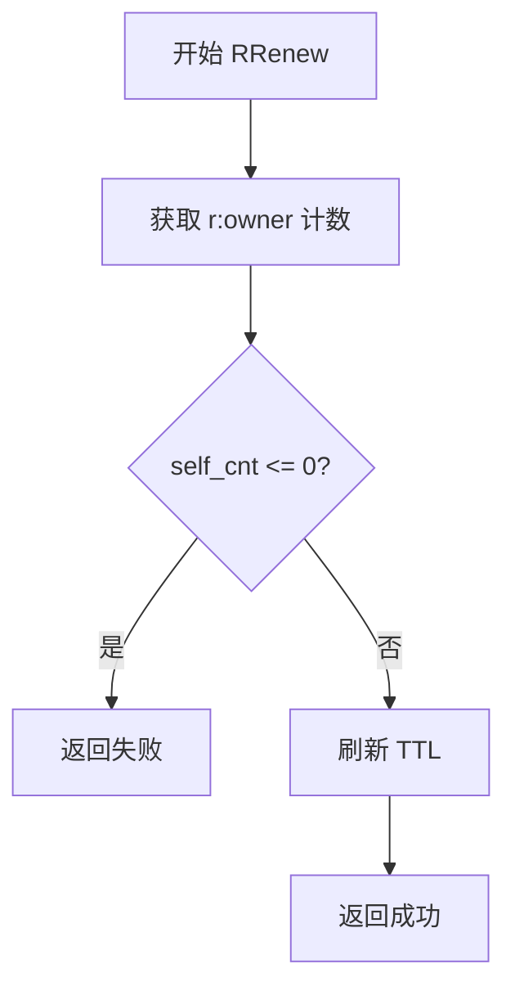
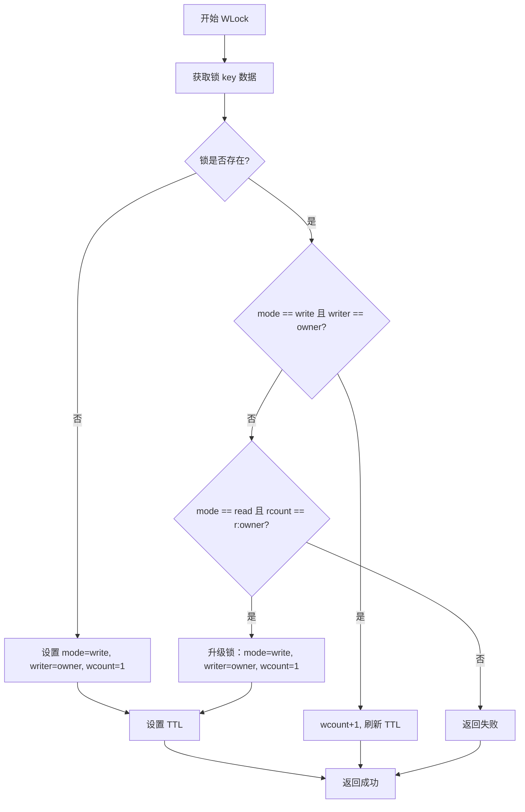
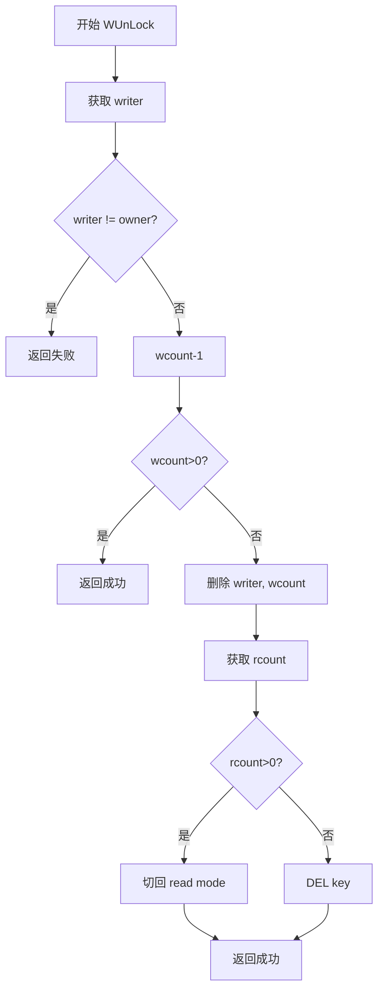
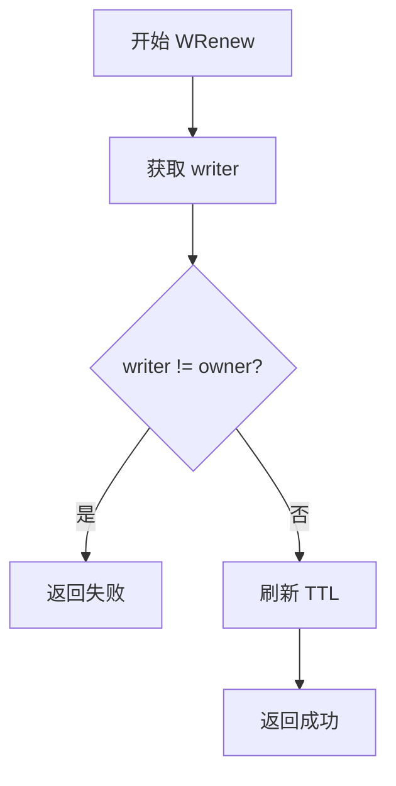
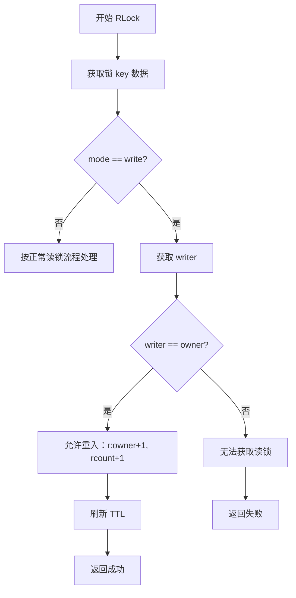
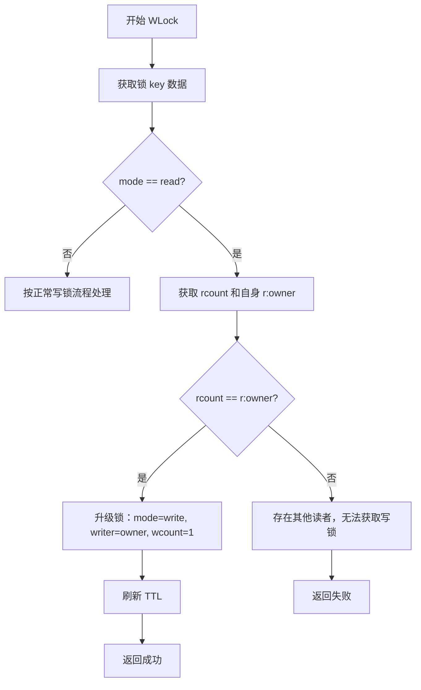

# 读写锁设计文档
本文档详细说明了基于 Redis 的读写锁实现，包括实现原理、锁状态、流程、事件和 Lua 脚本逻辑。

## 锁的设计目标

1. 读写分离：
   * 多个读者可以并发持有读锁。
   * 写者独占锁，写锁存在时阻止其他读/写锁获取。

2. 可重入：
   * 同一持有者可重复加读锁或写锁。
   * 持有写锁的同一持有者可以同时获取读锁。
   * 允许从“仅自己在读”升级到写锁。

3. 租约机制：
   * 锁设置 TTL（毫秒）保证超时自动释放。
   * 支持续期操作刷新 TTL。

4. 原子性：
   * 所有状态判断和更新通过单条 Lua 脚本完成，避免竞态。

5. 可观测性：
   * 脚本返回值统一，用于判断成功、失败和剩余 TTL。

## 锁的数据结构

使用 Redis Hash 存储单个资源锁状态，结构如下：

| 字段名      | 类型     | 说明                            |
|----------| ------ | ----------------------------- |
| mode     | string | 锁模式: "read" 或 "write"，不存在表示空闲 |
| rcount   | int    | 总读者数                          |
| r:{uuid} | int    | 某个持有者的读锁可重入计数                 |
| writer   | string | 当前写锁持有者 ID（仅 write 模式存在）      |
| wcount   | int    | 写锁可重入计数（仅 write 模式存在）         |

**uuid**: 当前使用 `github.com/google/uuid` 获取唯一标识。

## 锁状态流程图

### 读锁流程图
#### 读锁加锁流程（RLock）

#### 读锁解锁流程（RUnLock）

#### 读锁续期流程（RRenew）

### 写锁流程图
#### 写锁加锁流程（WLock）

#### 写锁解锁流程（WUnLock）

#### 写锁续期流程（WRenew）

### 其他情况流程图
#### 读锁加锁遇到写锁流程

#### 写锁加锁遇到读锁流程

## 锁操作事件
| 操作      | 条件/逻辑说明                             |
| ------- | ----------------------------------- |
| RLock   | 空闲或读锁模式时成功；写锁模式下若持有者为自己也成功，否则失败     |
| RUnLock | 自身读锁计数减 1；若总读者数为 0 且无写锁则删除锁键        |
| WLock   | 空闲时成功；持有写锁者可重入；读模式且仅自己读时可升级为写锁；否则失败 |
| WUnLock | 写计数减 1；归零时若有读者则切回读锁，否则删除锁键          |
| RRenew  | 刷新 TTL，仅当持有读锁的 owner 调用成功           |
| WRenew  | 刷新 TTL，仅当持有写锁的 owner 调用成功           |

## 注意事项
1. **uuid 唯一性**：确保每个客户端/线程使用唯一 uuid，避免破坏可重入计数。
2. **租期策略**：TTL 由 Redis 管理，客户端可以使用续期看门狗策略保持锁。
3. **升级与降级**：读锁可升级为写锁仅限“仅自己读”；写锁降级为读锁在写计数归零时自动处理。
4. **高并发优化**：单键结构在高并发场景下可能成为热点，可按资源做分片或使用 Lua 脚本保证原子性。
5. **异常恢复**：客户端崩溃后锁会自动过期，确保不会永久阻塞其他线程。
