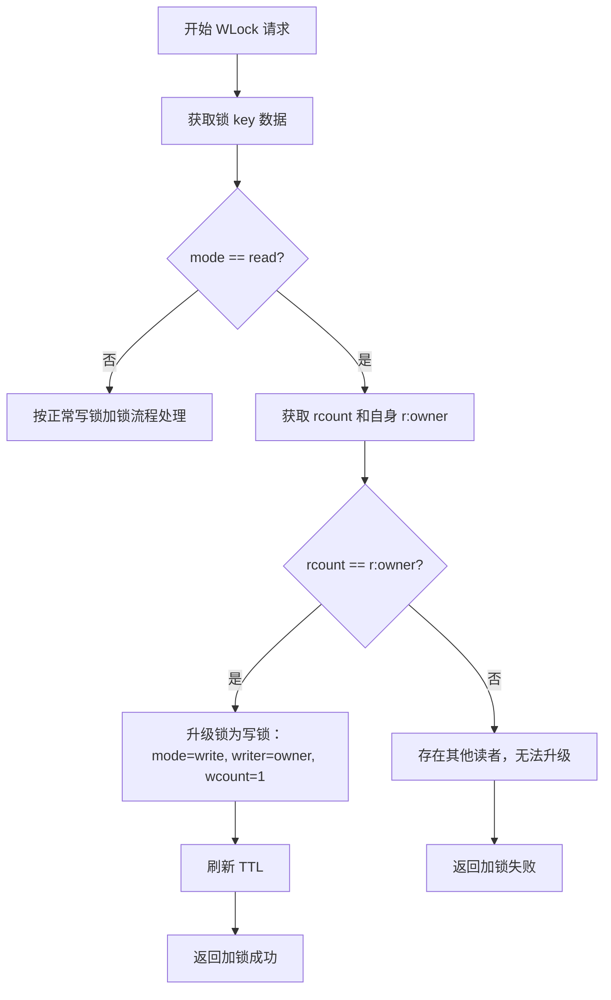
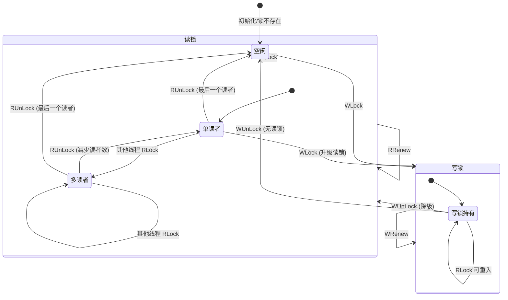

# 读锁升级为写锁流程文档

## 背景说明
在 Redis 实现的读写锁中：
* **读锁（Read Lock）** 可以被多个读者同时持有
* **写锁（Write Lock）** 是独占的，持有写锁的线程可以同时持有读锁（可重入）
* **升级需求**：当一个线程已经持有读锁并希望获取写锁时，需要判断是否可以安全升级为写锁

升级写锁的核心原则：

1. **只允许自己独占的读锁升级**
* 总读者数等于自己持有的读锁数量
* 其他线程持有的读锁阻止升级

2. **升级原子化**
* 必须通过 Lua 脚本在 Redis 中原子操作
* 确保在升级过程中没有其他线程获取读锁或写锁

## 升级条件

在执行写锁加锁操作时：

1. 先获取锁的模式 `mode`
* 如果 `mode` 为 `read`，则进入升级判断

2. 获取总读者数 `rcount` 和当前线程读锁计数 `r:owner`

3. 判断是否满足升级条件：
```text
rcount == r:owner
```
* 条件成立：当前线程是唯一读锁持有者，可以升级
* 条件不成立：存在其他读锁，无法升级

## 升级处理逻辑
当升级条件满足时，处理步骤如下：

1. 将锁模式切换为写锁：
```text
mode = 'write'
```

2. 设置写锁持有者：
```text
writer = owner
```

3. 初始化写锁可重入计数：
```text
wcount = 1
```

4. 刷新锁的 TTL：
```text
PEXPIRE(local_key, lock_ttl)
```

5. 返回加锁成功

如果升级条件不满足，则返回加锁失败，等待或重试

## Lua 脚本示例

```lua
-- 获取总读者数和自身读锁计数
local total = tonumber(redis.call('HGET', local_key, 'rcount') or '0')
local self_cnt = tonumber(redis.call('HGET', local_key, 'r:' .. lock_value) or '0')

if total == self_cnt then
-- 升级读锁为写锁
redis.call('HSET', local_key,
'mode', 'write',
'writer', lock_value,
'wcount', 1)
redis.call('PEXPIRE', local_key, lock_ttl)
return 1-- 升级成功
end

-- 如果其他线程也持有读锁，则升级失败
return 0
```

## 流程图



## 锁状态生命周期



## 注意事项

1. **原子操作**：升级必须在 Lua 脚本中执行，避免多线程竞争导致错误升级
2. **可重入**：升级后，写锁持有者可以再次加写锁或读锁
3. **失败处理**：如果升级失败，线程可选择自旋等待、重试或直接返回失败
4. **TTL 管理**：升级操作完成后一定要刷新 TTL，避免锁过期被其他线程抢占
